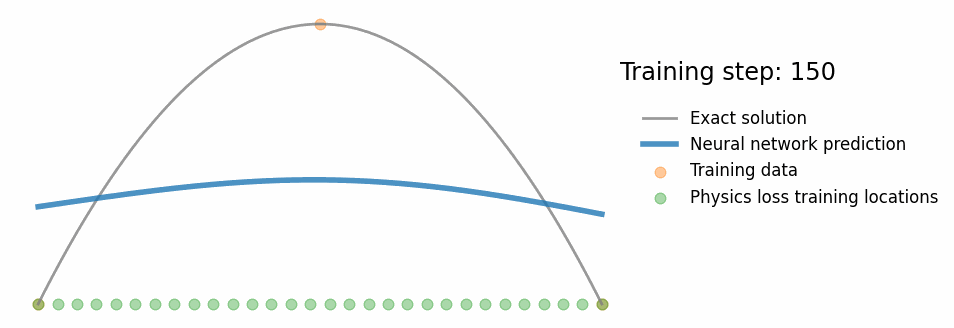
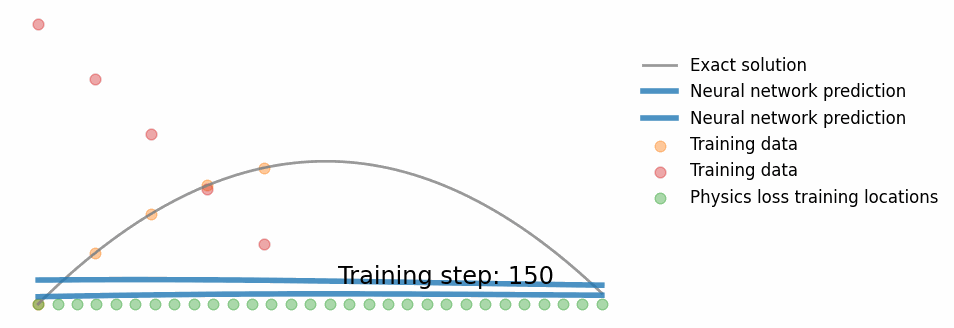
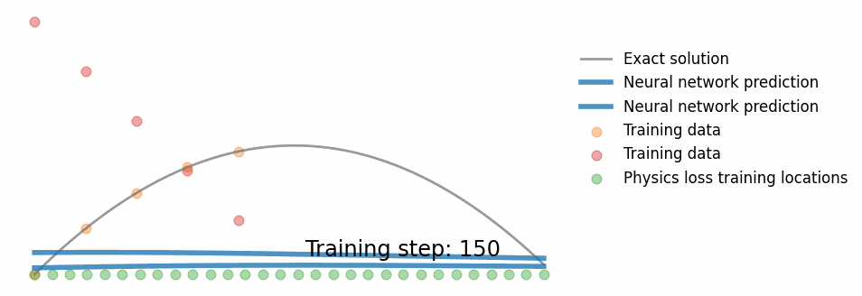

# harmonic-oscillator-pinn

Forked from code accompanying this blog post: [So, what is a physics-informed neural network?]
(https://benmoseley.blog/my-research/so-what-is-a-physics-informed-neural-network/)

## This fork adds 2 more examples:

[DiffusionPINN.ipynb](./DiffusionPINN.ipynb):

Example where we have few "sensors" (points we can measure) but know the governing equation of the system well.

[BallisticsPINN.ipynb](./BallisticsPINN.ipynb):

Example where we have multiple observations and don't have a governing equation (artifically) of the system, but resort
to more general physical laws, in this case conservation of energy.

...and explain why this might not be enough, and add another physics constraint - Newton's second law:

